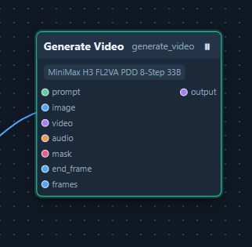
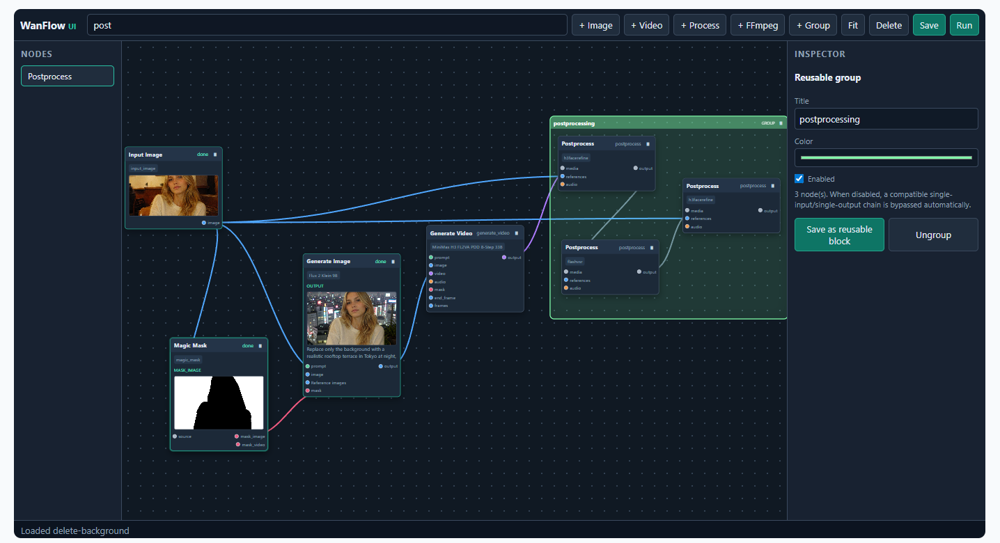
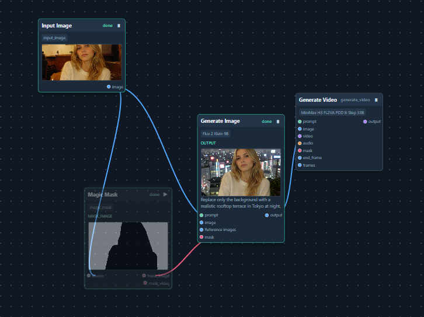
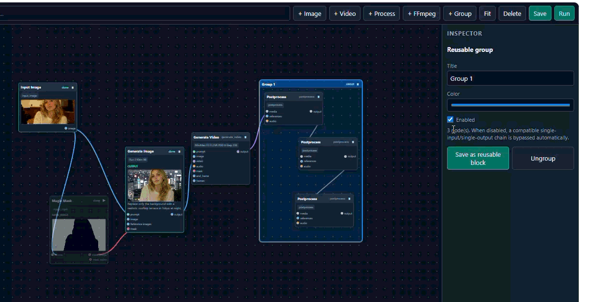

# Wan2GP WanFlow UI

WanFlow UI is a visual node-based workflow editor for Wan2GP. It provides a ComfyUI-inspired canvas while keeping Wan2GP's native model, processor, media, queue, and FFmpeg contracts.

The project is a Wan2GP plugin. It is intentionally not a standalone inference engine and does not attempt to replace Wan2GP's model management or runtime.

## Screenshots

### Model-aware node

Each generation node exposes the ports and controls supported by its selected model. The example below shows a video node with prompt, image, video, audio, mask, end-frame, and injected-frame inputs.



### Connected workflow and reusable group

The canvas supports connected branches, previews, masks, postprocessing, and reusable groups that can be enabled or disabled as a unit.



### Fast previews with disabled nodes and groups

Nodes and reusable groups can be disabled without deleting them. This makes it easy to bypass a mask, generator, or postprocessing stage for a quick preview, then enable it again for the final render.





## Features

- Movable nodes, typed ports, SVG connections, zoom, pan, selection, and fit-to-view.
- Topological execution with branches and convergences.
- Model-aware generation, editing, inpainting, references, masks, audio, LoRAs, resolution, aspect ratio, and native model settings.
- AI analysis with text outputs and workflow variables.
- Wan2GP postprocessors discovered from the installed catalog.
- Safe typed FFmpeg operations using Wan2GP-managed binaries.
- Runtime image, video, audio, and mask previews.
- Reusable colored groups with per-node and per-group enable/disable controls.
- Reusable blocks saved as editable subgraphs.
- JSON workflows with the `wan2gp-wanflow-ui` schema.

## Requirements

- A compatible Wan2GP installation.
- The Python and Gradio environment provided by Wan2GP.
- Wan2GP's installed model catalog and postprocessor catalog.
- Wan2GP-managed `ffmpeg` and `ffprobe` for media operations.

No external JavaScript or graph libraries are required. Models, LoRAs, processors, and large media files are not bundled with this plugin.

## Installation

Copy the `wan2gp-wanflow-ui` directory into Wan2GP's `plugins` directory:

```text
Wan2GP/
  plugins/
    wan2gp-wanflow-ui/
```

Restart Wan2GP and open the `WanFlow UI` tab. The plugin reads available models, LoRAs, processors, resolutions, and media binaries from the running Wan2GP installation.

## Basic usage

1. Add nodes from the palette.
2. Drag from an output port to a compatible input port.
3. Select a node to edit its parameters in the Inspector.
4. Upload runtime media and assign input nodes to their slot numbers.
5. Save the workflow or press `Run`.

The runner validates ports, required inputs, model capabilities, and cycles before execution. Dependencies determine execution order; independent branches run serially by default to reduce VRAM pressure.

The `Magic Mask` node accepts an image or video source and object keywords such as `person, car, sky`. Connect its `mask_image` output to image inpainting or its `mask_video` output to video inpainting. The node uses Wan2GP's managed Magic Mask assets and downloads them on first use when necessary.

Generation nodes also support remote LoRA URLs. Add them in the LoRA section of the Inspector and set their strength; Wan2GP resolves and caches the URL when the workflow runs.

## Groups and reusable blocks

Select multiple nodes with `Shift`, then use `+ Group` or `Ctrl+G`. Groups can be renamed, recolored, moved, and enabled or disabled. A disabled group with one compatible input boundary can bypass a simple media chain, which is useful for making a fast preview without postprocessing.

Use `Save as reusable block` in the group Inspector to save an editable subgraph. Saved blocks appear in the palette and can be inserted into another workflow. User blocks are stored locally under `blocks/` and are intentionally ignored by Git.

## Examples

Curated examples are stored under `examples/`. They use runtime input slots and do not contain absolute paths or generated media. Select a model in the Inspector when an example contains a generation node.

## Storage

| Directory | Purpose | Public repository policy |
| --- | --- | --- |
| `examples/` | Curated starter workflows | Versioned |
| `workflows/` | User-saved workflows | Local and ignored |
| `blocks/` | User-saved reusable blocks | Local and ignored |
| `workflow_outputs/` | Runtime media outputs | Local and ignored |

Workflow JSON stores graph structure and parameters, not permanent runtime file paths.

## Development

Run the test suite from the Wan2GP environment:

```powershell
venv\Scripts\python.exe -m unittest discover -s plugins/wan2gp-wanflow-ui/tests -v
node --check plugins/wan2gp-wanflow-ui/assets/editor.js
```

The tests cover graph normalization, typed connections, cycles, disabled groups, block storage, model metadata, imports, and the Gradio plugin constructor.

## Scope and compatibility

WanFlow UI is compatible with Wan2GP's native runtime rather than with ComfyUI's JSON or execution format. It uses Wan2GP host APIs, so compatibility depends on the Wan2GP version and the capabilities exposed by that installation.

## License

The original WanFlow UI code in this repository is licensed under the Apache License 2.0; see [`LICENSE`](LICENSE).

WanFlow UI is an add-on for WanGP/Wan2GP and does not relicense WanGP/Wan2GP. The applicable WanGP/Wan2GP license text is preserved in [`LICENSE.txt`](LICENSE.txt). When redistributing WanGP/Wan2GP together with this plugin, preserve that license and the applicable notices.

Models, LoRAs, processors, FFmpeg, Python packages, and other third-party materials are not relicensed by this project. They remain subject to their own terms. See [`THIRD_PARTY_NOTICES.md`](THIRD_PARTY_NOTICES.md).
